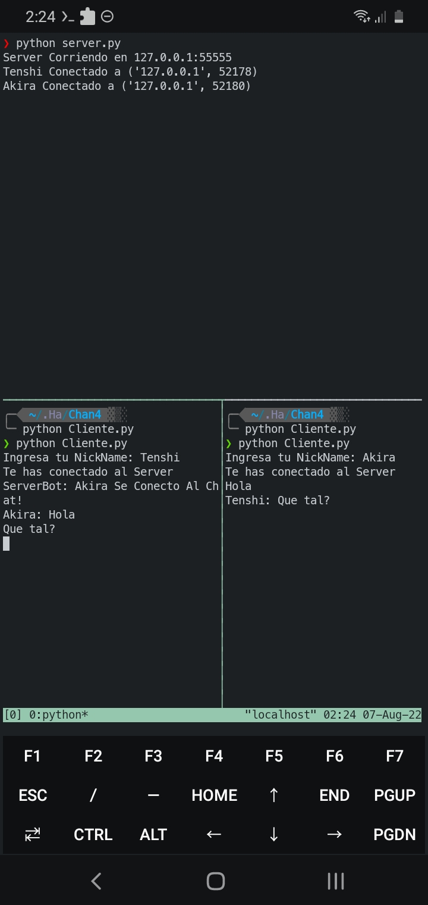

# IRC-TCP
Chat servidor TCP personal y secreto establece un host y port para un chat 

##### Metodo de uso 

##### python server.py

especifica un host y un port TCP

##### En otra pestaña
##### python Cliente.py

aqui se usa el host y el puerto establecido en el server

<h5>

</h5>
